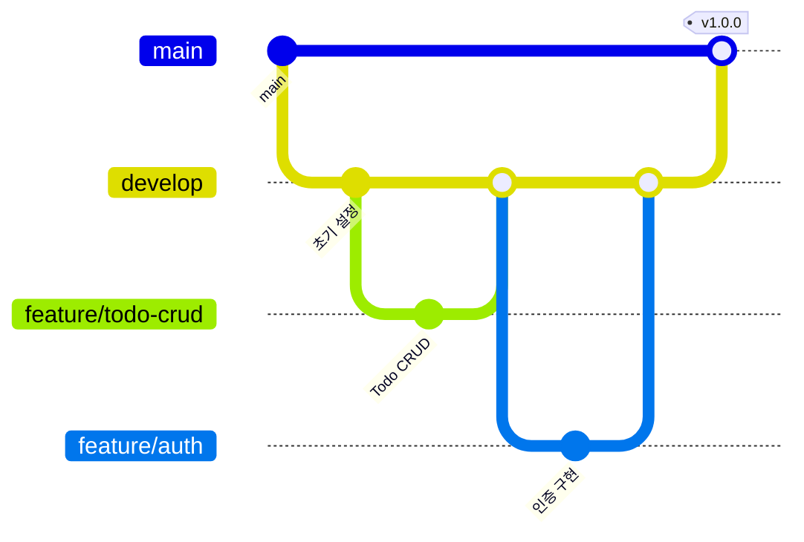

# 🚀 TodoList - Claude Code AI 협업 스터디 프로젝트

[](https://choosealicense.com/licenses/mit/)
[](https://spring.io/projects/spring-boot)
[](https://vuejs.org/)
[](https://claude.ai)

## 📋 목차

- [프로젝트 소개](#프로젝트-소개)
- [핵심 목표](#핵심-목표)
- [기술 스택](#기술-스택)
- [프로젝트 구조](#프로젝트-구조)
- [시작하기](#시작하기)
- [협업 가이드](#협업-가이드)
- [트러블슈팅](#트러블슈팅)

---

## 프로젝트 소개

### 🎯 미션

**"AI와 함께하는 5명의 개발자가 충돌 없이 협업하는 방법을 찾아라!"**

이 프로젝트는 단순한 TodoList 앱 개발이 아닙니다. Claude Code를 활용한 AI 페어 프로그래밍 환경에서 **5명의 개발자가 동시에 작업하면서도 서로의 코드를 망치지 않는** 실전 협업 방법론을
개발하고 검증하는 실험입니다.

### 🤔 우리가 해결하려는 문제

- **"5명이 동시에 같은 파일을 수정해야 할 때 어떻게 조율할까?"**
- **"AI의 도움을 받으면서도 코드 일관성을 유지하려면?"**
- **"실전에서 바로 쓸 수 있는 AI 협업 템플릿을 만들 수 있을까?"**

### 📊 프로젝트 성과 지표

- ⏱️ 보일러 플레이트 구축: **초기 프로젝트 시간 단축** 목표
- 🐛 AI 코드리뷰 활용: **버그 및 보안 위험 대폭 감소** 목표
- 📈 팀 생산성: **2배 향상** 목표

---

## 핵심 목표

### 🎯 Phase 1: AI 협업 환경 구축

- [ ] Claude Code + MCP 설정 완료
- [ ] Git 브랜치 전략 수립
- [ ] AI 컨텍스트 관리 체계 구축
- [ ] 충돌 방지 Hook 스크립트 작성
- [ ] 팀원별 작업 영역 정의

### 🎯 Phase 2: 보일러플레이트 개발

- [ ] Spring Boot 프로젝트 기본 구조
- [ ] Vue3 프로젝트 기본 구조
- [ ] Todo CRUD API 개발

### 🎯 Phase 3: 실전 검증 및 문서화

- [ ] 베스트 프랙티스 문서화
- [ ] 트러블슈팅 가이드 작성

---

## 기술 스택

### Backend

```yaml
Language: Java 17
Framework: Spring Boot 3.x.x
Database: MySQL 8.0
ORM: JPA/Hibernate
Build: Gradle 8.x
Test: JUnit 5, MockMvc
```

### Frontend

```yaml
Framework: Vue 3.4.x
Build Tool: Vite 5.x
State Management: Pinia
Router: Vue Router 4.x
UI: Tailwind CSS 3.x
HTTP Client: Axios
Test: Vitest + Vue Test Utils
```

### AI & Collaboration

```yaml
AI Assistant: Claude Code
Protocol: MCP (Model Context Protocol)
Task Management: Claude Task Master
Version Control: Git + GitHub
CI/CD: GitHub Actions
Container: Docker + Docker Compose
```

---

## 프로젝트 구조

```
todolist/
├── 📁 backend/
│   ├── 📁 src/
│   │   ├── 📁 main/
│   │   │   ├── 📁 java/com/todolist/
│   │   │   │   ├── 📁 config/       # 설정 클래스
│   │   │   │   ├── 📁 controller/   # REST API 엔드포인트
│   │   │   │   ├── 📁 service/      # 비즈니스 로직
│   │   │   │   ├── 📁 repository/   # 데이터 접근 계층
│   │   │   │   ├── 📁 entity/       # JPA 엔티티
│   │   │   │   ├── 📁 dto/          # 계층간 데이터 전송 객체
│   │   │   │   └── 📁 form/         # 컨트롤러 요청/응답 폼 객체 
│   │   │   └── 📁 resources/
│   │   └── 📁 test/
│   ├── 📄 build.gradle
│   └── 📄 CLAUDE.md                 # 백엔드 AI 규칙
│
├── 📁 frontend/
│   ├── 📁 src/
│   │   ├── 📁 assets/               # 정적 리소스
│   │   ├── 📁 components/           # Vue 컴포넌트
│   │   ├── 📁 views/                # 페이지 컴포넌트
│   │   ├── 📁 stores/               # Pinia 스토어
│   │   ├── 📁 router/               # 라우터 설정
│   │   ├── 📁 api/                  # API 클라이언트
│   │   └── 📁 utils/                # 유틸리티 함수
│   ├── 📄 package.json
│   ├── 📄 vite.config.js
│   └── 📄 CLAUDE.md                 # 프론트엔드 AI 규칙
│
├── 📁 docker/
│   ├── 📄 Dockerfile.backend
│   ├── 📄 Dockerfile.frontend
│   └── 📄 docker-compose.yml
│
├── 📁 .claude/
│   ├── 📁 hooks/                    # AI 제어 스크립트
│   └── 📁 commands/                 # 커스텀 명령어
│
├── 📄 .mcp.json                     # MCP 서버 설정
├── 📄 CLAUDE.md                     # 전체 AI 협업 규칙
├── 📄 .claudeignore                 # AI 접근 제한 파일
└── 📄 README.md                     # 현재 문서
```

---

## 시작하기

### 📋 Prerequisites

- Java 17+
- Node.js 20+
- Docker Desktop
- Claude Code 계정
- Git

### 🚀 Quick Start

#### 1. 프로젝트 클론

```bash
git clone https://github.com/niceday-tony/todolist.git
cd todolist
```

#### 2. 환경 변수 설정

```bash
# .env 파일 생성 (템플릿 복사)
cp .env.example .env

# .env 파일을 열어 GitHub Token 설정
# GITHUB_TOKEN=ghp_your_actual_token_here
```

**GitHub Personal Access Token 생성 방법:**
1. GitHub 로그인 → Settings → Developer settings
2. Personal access tokens → Tokens (classic)
3. Generate new token (classic) 클릭
4. 필요한 권한 선택:
   - `repo` - 저장소 전체 접근
   - `workflow` - GitHub Actions 워크플로우
   - `write:packages` - 패키지 레지스트리 업로드
5. Generate token 클릭 후 토큰을 안전하게 저장

#### 3. Claude Code & MCP 설정

```bash
# Claude 로그인
claude login

# MCP 설정 복사
cp .mcp.json ~/.claude/mcp_config.json

# Hook 스크립트 설치 (준비 중)
# cp -r .claude/hooks ~/.claude/
# chmod +x ~/.claude/hooks/*
```

#### 4. 백엔드 실행

```bash
cd backend
./gradlew bootRun
# API 서버: http://localhost:8080
```

#### 5. 프론트엔드 실행

```bash
cd frontend
npm install
npm run dev
# 웹 애플리케이션: http://localhost:5173
```

#### 6. Docker 환경

```bash
docker-compose up -d
```

---

## 협업 가이드

### 🌿 브랜치 전략




### 📝 작업 프로세스

1. **작업 시작**
   ```bash
   # 이슈 생성 및 할당
   gh issue create --title "기능명" --assignee @me
   
   # 브랜치 생성
   git checkout -b feature/기능명
   
   # Claude에게 컨텍스트 제공
   echo "작업: 기능명 구현" > .claude-context
   ```

2. **AI와 협업**
   ```bash
   # Claude Code 실행
   claude "Todo 생성 API 구현해줘. 
          POST /api/todos 엔드포인트 추가하고
          TodoService.createTodo 메서드 구현"
   ```

3. **코드 리뷰**
   ```bash
   # PR 생성
   gh pr create --title "feat: 기능명" --body "설명"
   
   # AI 리뷰 요청
   @code-reviewer "이 PR 리뷰해줘"
   ```

### 🔒 충돌 방지 규칙

#### CLAUDE.md 핵심 규칙

```markdown
## 절대 규칙
1. main 브랜치 직접 push 금지
2. 공통 파일(Entity, DTO) 수정 시 PR 필수
3. force push 절대 금지

## AI 제어 명령
- "다른 모듈은 수정하지 마"
- "기존 코드는 유지하고 추가만 해"
- "충돌 발생 시 중단하고 알려줘"
```

---

## 트러블슈팅

### 🐛 자주 발생하는 문제

<details>
<summary><b>문제 1: Claude가 다른 사람 코드를 수정함</b></summary>

**증상**: AI가 지시하지 않은 파일을 수정

**해결방법**:

```bash
# Hook 스크립트 설치
cp .claude/hooks/boundary_guard.py ~/.claude/hooks/
chmod +x ~/.claude/hooks/boundary_guard.py

# 환경변수 설정
export CLAUDE_USER="A"  # 자신의 ID
```

</details>

<details>
<summary><b>문제 2: MCP 서버 연결 실패</b></summary>

**증상**: Claude가 외부 도구 접근 불가

**해결방법**:

```bash
# MCP 서버 재시작
claude logout
claude login
cp .mcp.json ~/.claude/mcp_config.json
```

</details>

---

## 📚 참고 자료

### 공식 문서

- [Claude Code Documentation](https://docs.anthropic.com/claude-code)
- [Spring Boot Guide](https://spring.io/guides)
- [Vue.js Documentation](https://vuejs.org/guide/)

### 커뮤니티 리소스

- [MCP Server Examples](https://github.com/modelcontextprotocol)
- [SuperClaude Framework](https://github.com/superclaude)

---

## 📄 라이선스

MIT License - 자세한 내용은 [LICENSE](LICENSE) 파일 참조


---

## 📧 Contact

- **Project Link**: [https://github.com/niceday-tony/todolist](https://github.com/niceday-tony/todolist)
- **Issues**: [GitHub Issues](https://github.com/niceday-tony/todolist/issues)

---

<div align="center">

**🚀 Happy Coding with Claude! 🚀**

*"step by step으로 조급해하지말고 진행해봅시다!"*

</div>