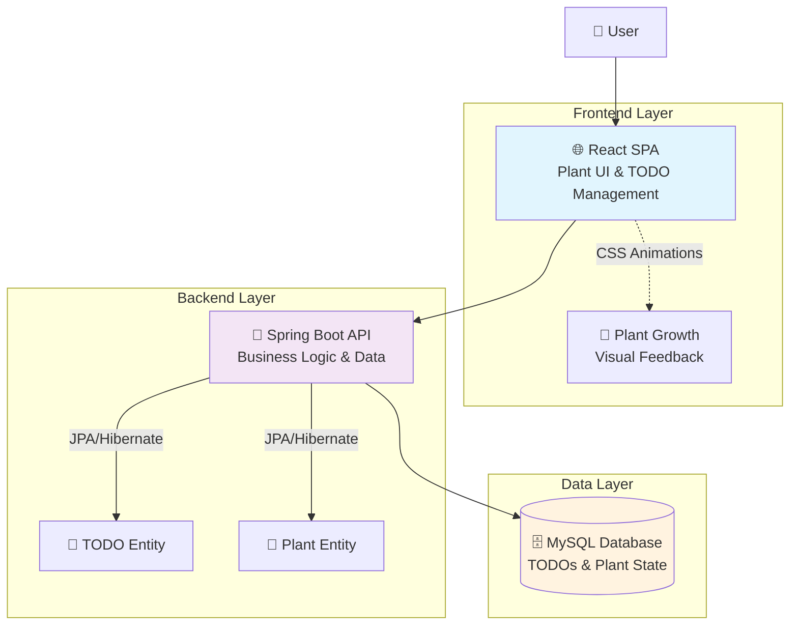
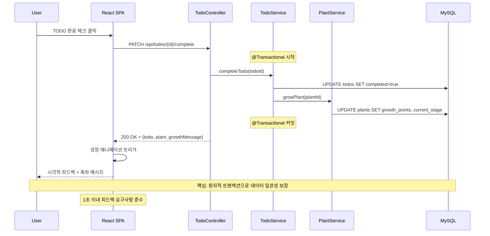

# TodoList Architecture Document

## Introduction

이 문서는 **TodoList**의 전체 프로젝트 아키텍처를 설명하며, 백엔드 시스템, 공유 서비스, 그리고 UI에 특화되지 않은 모든 관심사를 포함합니다. 이 문서의 주요 목표는 AI 기반 개발의 가이드 역할을 하여 일관성을 보장하고 선택된 패턴과 기술을 준수하도록 하는 것입니다.

**프론트엔드 아키텍처와의 관계:**
이 프로젝트는 중요한 사용자 인터페이스를 포함하므로, 별도의 프론트엔드 아키텍처 문서가 프론트엔드 특화 설계를 상세히 다루며 이 문서와 함께 사용되어야 합니다. 여기에 문서화된 핵심 기술 스택 선택사항("Tech Stack" 참조)은 프론트엔드 컴포넌트를 포함한 전체 프로젝트에 대해 확정적입니다.

### Starter Template or Existing Project

**결정 사항**: Spring Initializr와 Vite React TypeScript 템플릿 사용

**근거**: 1일 개발 제약을 고려할 때 스타터 템플릿 사용이 개발 속도에 크게 도움되며, 기존 MySQL 환경과 완벽하게 호환됩니다.

### Change Log
| Date | Version | Description | Author |
|------|---------|-------------|---------|
| 2025-09-14 | 1.0 | Initial architecture creation from PRD | Architect Winston |

## High Level Architecture

### Technical Summary

TodoList는 **모놀리식 웹 애플리케이션**으로 설계되었습니다. Spring Boot 백엔드가 RESTful API를 제공하고, React SPA가 이를 소비하는 전형적인 3-tier 아키텍처를 채택했습니다. 핵심은 **TODO 완료와 식물 성장을 실시간으로 연결하는 감정적 피드백 시스템**으로, JPA를 통한 트랜잭셔널 데이터 관리와 React의 상태 기반 애니메이션이 결합되어 1초 이내의 즉각적인 사용자 피드백을 보장합니다.

### High Level Overview

**1. 아키텍처 스타일**: 모놀리식 웹 애플리케이션 (Monolithic Web Application)
- **근거**: 1일 개발 제약, 작은 팀 규모, MVP 복잡성 수준에 최적화

**2. 저장소 구조**: 모노레포 (Monorepo)
- **근거**: PRD에서 명시된 대로 코드 공유와 배포 단순화의 이점

**3. 서비스 아키텍처**: 단일 Spring Boot 애플리케이션
- **구성**: REST API 백엔드 + React SPA 프론트엔드
- **통신**: HTTP/JSON 기반 RESTful API

**4. 주요 사용자 상호작용 흐름**:
```
사용자 TODO 생성 → 백엔드 저장 → 프론트엔드 목록 업데이트
→ 사용자 TODO 완료 → 백엔드 식물 성장 로직 → 프론트엔드 애니메이션 트리거
```

**5. 핵심 아키텍처 결정**:
- **데이터 일관성**: JPA 트랜잭션으로 TODO-Plant 상태 동기화 보장
- **실시간 피드백**: 동기 API 호출로 1초 이내 응답 보장
- **상태 관리**: React 내장 상태 관리 (복잡성 최소화)
- **배포 단순성**: 단일 JAR + 정적 파일 서빙

### High Level Project Diagram



### Architectural and Design Patterns

**핵심 패턴들:**

- **MVC 패턴**: Spring Boot의 MVC (Controller-Service-Repository) 표준 활용
- **Repository 패턴**: Spring Data JPA Repository 패턴으로 데이터 접근 추상화
- **RESTful API 패턴**: Resource-Based Communication with JSON

## Tech Stack

이것은 **확정적 기술 선택 섹션**입니다. 모든 다른 문서들은 이 선택사항들을 참조해야 합니다.

### Cloud Infrastructure
- **Provider**: 로컬 개발 (초기 MVP, 클라우드 배포 제외)
- **Key Services**: Docker Compose (MySQL), 로컬 실행환경
- **Deployment Regions**: 해당 없음 (로컬 개발)

### Technology Stack Table

| Category | Technology | Version | Purpose | Rationale |
|----------|------------|---------|---------|-----------|
| **Language** | Java | 17 | 백엔드 주 언어 | LTS 버전, 팀 전문성, Spring Boot 3.x 호환 |
| **Runtime** | JVM | OpenJDK 17 | Java 실행 환경 | 안정성, 무료, 크로스 플랫폼 |
| **Backend Framework** | Spring Boot | 3.2.x | 백엔드 프레임워크 | 빠른 개발, Auto-configuration, 풍부한 생태계 |
| **Data Access** | Spring Data JPA | 3.2.x | ORM 및 데이터 접근 | JPA 표준, Repository 패턴, 쿼리 자동생성 |
| **Database** | MySQL | 8.0 | 관계형 데이터베이스 | 기존 docker-compose 활용, 안정성, 성능 |
| **Build Tool** | Maven | 3.9.x | 백엔드 빌드 관리 | Spring Boot 표준, 의존성 관리 우수 |
| **Frontend Language** | TypeScript | 5.3.x | 프론트엔드 주 언어 | 타입 안전성, React와 완벽 호환, 개발 생산성 |
| **Frontend Framework** | React | 18.2.x | UI 라이브러리 | 컴포넌트 기반, 생태계 풍부, 애니메이션 지원 |
| **Build Tool (FE)** | Vite | 5.x | 프론트엔드 빌드 도구 | 빠른 HMR, TypeScript 지원, 현대적 번들링 |
| **HTTP Client** | Axios | 1.6.x | API 통신 | Promise 기반, 인터셉터, 에러 처리 우수 |
| **Styling** | CSS Modules | - | 스타일 관리 | 스코프된 CSS, 네이밍 충돌 방지, 가벼움 |
| **Animation** | CSS Transitions | - | 식물 성장 애니메이션 | 성능 우수, 브라우저 네이티브, 부드러운 효과 |
| **Container** | Docker Compose | 2.x | MySQL 컨테이너 실행 | 기존 환경 활용, 일관된 개발환경 |

## Data Models

### TODO (할 일)

**Purpose:** 사용자의 일상 업무와 목표를 관리하며, 완료시 식물 성장의 트리거 역할

**Key Attributes:**
- `id`: Long - 고유 식별자 (Primary Key)
- `title`: String(255) - 할 일 제목 (NOT NULL)
- `description`: String(1000) - 상세 설명 (Optional)
- `completed`: Boolean - 완료 상태 (기본값: false)
- `completedAt`: LocalDateTime - 완료 시각 (완료시에만 설정)
- `createdAt`: LocalDateTime - 생성 시각 (자동 설정)
- `updatedAt`: LocalDateTime - 수정 시각 (자동 업데이트)
- `plantId`: Long - 소속 식물 ID (Foreign Key)

**Relationships:**
- `belongsTo Plant` - 각 TODO는 하나의 식물에 속함 (Many-to-One)
- 완료시 연관된 Plant의 growthPoints 증가 트리거

### Plant (식물 동반자)

**Purpose:** 사용자의 디지털 동반자로서 TODO 완료에 따라 성장하며 감정적 피드백 제공

**Key Attributes:**
- `id`: Long - 고유 식별자 (Primary Key)
- `name`: String(50) - 식물 이름 (기본값: "내 식물")
- `species`: String(50) - 식물 종류 (예: "해바라기", "장미")
- `growthPoints`: Integer - 성장 포인트 (TODO 완료시 +1)
- `currentStage`: Integer - 현재 성장 단계 (1-5, growthPoints 기반 계산)
- `mood`: String(20) - 현재 기분 상태 (Epic 2 확장 기능)
- `createdAt`: LocalDateTime - 생성 시각
- `lastInteractionAt`: LocalDateTime - 마지막 상호작용 시각

**Relationships:**
- `hasMany TODOs` - 하나의 식물은 여러 TODO를 가짐 (One-to-Many)
- 성장 단계 계산 로직: `currentStage = min(5, (growthPoints / 3) + 1)`

## Components

### TodoController

**Responsibility:** TODO 관련 HTTP 요청 처리 및 RESTful API 엔드포인트 제공

**Key Interfaces:**
- `POST /api/todos` - 새 TODO 생성
- `GET /api/todos` - TODO 목록 조회
- `PUT /api/todos/{id}` - TODO 수정
- `DELETE /api/todos/{id}` - TODO 삭제
- `PATCH /api/todos/{id}/complete` - TODO 완료 처리 (식물 성장 트리거)

**Dependencies:** TodoService, 글로벌 Exception Handler

**Technology Stack:** Spring Boot @RestController, Spring Web, JSON 직렬화

### TodoService

**Responsibility:** TODO 비즈니스 로직 처리 및 식물 성장 연동

**Key Interfaces:**
- `createTodo(TodoCreateRequest)` - TODO 생성 비즈니스 로직
- `completeTodo(Long todoId)` - TODO 완료 처리 및 Plant 성장 트리거
- `findTodosByPlant(Long plantId)` - 식물별 TODO 목록 조회

**Dependencies:** TodoRepository, PlantService, 트랜잭션 매니저

**Technology Stack:** Spring @Service, @Transactional 어노테이션

### TodoRepository

**Responsibility:** TODO 엔티티 데이터베이스 접근 및 CRUD 연산

**Key Interfaces:**
- `findByPlantIdOrderByCreatedAtDesc(Long plantId)` - 식물별 TODO 시간순 조회
- `countByPlantIdAndCompleted(Long plantId, Boolean completed)` - 완료 상태별 카운트

**Dependencies:** MySQL 데이터베이스

**Technology Stack:** Spring Data JPA Repository

### PlantController

**Responsibility:** 식물 관련 HTTP 요청 처리 및 성장 상태 API 제공

**Key Interfaces:**
- `GET /api/plants/{id}` - 식물 상태 조회
- `GET /api/plants/{id}/growth-status` - 성장 단계 및 진행률 조회

**Dependencies:** PlantService

### PlantService

**Responsibility:** 식물 성장 로직 및 상태 관리 핵심 비즈니스 로직

**Key Interfaces:**
- `growPlant(Long plantId)` - 성장 포인트 증가 및 단계 업데이트
- `calculateGrowthStage(Integer growthPoints)` - 성장 포인트 기반 단계 계산
- `getGrowthProgress(Long plantId)` - 현재 단계 진행률 계산

**Dependencies:** PlantRepository

### PlantRepository

**Responsibility:** Plant 엔티티 데이터베이스 접근 및 성장 상태 관리

**Key Interfaces:**
- `findById(Long id)` - 식물 조회
- `save(Plant plant)` - 식물 상태 저장

**Dependencies:** MySQL 데이터베이스

## Core Workflows

### TODO 완료 및 식물 성장 워크플로 (핵심)



## REST API Spec

```yaml
openapi: 3.0.0
info:
  title: TodoList API
  version: 1.0.0
  description: |
    TodoList 백엔드 API - TODO 관리와 식물 동반자 시스템
    TODO 완료시 식물이 성장하는 감정적 피드백 시스템을 제공합니다.

servers:
  - url: http://localhost:8080/api
    description: 로컬 개발 서버

paths:
  /todos:
    get:
      summary: TODO 목록 조회
      parameters:
        - name: plantId
          in: query
          schema:
            type: integer
            default: 1
      responses:
        '200':
          description: TODO 목록 조회 성공
    post:
      summary: 새 TODO 생성
      requestBody:
        required: true
        content:
          application/json:
            schema:
              type: object
              required: [title, plantId]
              properties:
                title:
                  type: string
                  maxLength: 255
                description:
                  type: string
                  maxLength: 1000
                plantId:
                  type: integer
                  default: 1
      responses:
        '201':
          description: TODO 생성 성공

  /todos/{id}/complete:
    patch:
      summary: TODO 완료 처리 (핵심 엔드포인트)
      parameters:
        - name: id
          in: path
          required: true
          schema:
            type: integer
      responses:
        '200':
          description: TODO 완료 및 식물 성장 성공

  /plants/{id}:
    get:
      summary: 식물 상태 조회
      parameters:
        - name: id
          in: path
          required: true
          schema:
            type: integer
      responses:
        '200':
          description: 식물 상태 조회 성공
```

## Database Schema

기존 `todolist` 데이터베이스를 활용하여 스키마를 구성합니다.

```sql
-- 기존 todolist 데이터베이스 사용
USE todolist;

-- Plants 테이블 (식물 동반자)
CREATE TABLE plants (
    id BIGINT AUTO_INCREMENT PRIMARY KEY,
    name VARCHAR(50) NOT NULL DEFAULT '내 식물',
    species VARCHAR(50) NOT NULL DEFAULT '해바라기',
    growth_points INT NOT NULL DEFAULT 0,
    current_stage TINYINT NOT NULL DEFAULT 1,
    mood VARCHAR(20) DEFAULT 'happy',
    created_at TIMESTAMP NOT NULL DEFAULT CURRENT_TIMESTAMP,
    last_interaction_at TIMESTAMP NULL DEFAULT NULL,
    updated_at TIMESTAMP NOT NULL DEFAULT CURRENT_TIMESTAMP ON UPDATE CURRENT_TIMESTAMP,

    CONSTRAINT plants_growth_points_positive CHECK (growth_points >= 0),
    CONSTRAINT plants_stage_range CHECK (current_stage BETWEEN 1 AND 5)
) ENGINE=InnoDB;

-- TODOs 테이블 (할 일 목록)
CREATE TABLE todos (
    id BIGINT AUTO_INCREMENT PRIMARY KEY,
    title VARCHAR(255) NOT NULL,
    description TEXT DEFAULT NULL,
    completed BOOLEAN NOT NULL DEFAULT FALSE,
    completed_at TIMESTAMP NULL DEFAULT NULL,
    created_at TIMESTAMP NOT NULL DEFAULT CURRENT_TIMESTAMP,
    updated_at TIMESTAMP NOT NULL DEFAULT CURRENT_TIMESTAMP ON UPDATE CURRENT_TIMESTAMP,
    plant_id BIGINT NOT NULL,

    CONSTRAINT fk_todos_plant_id
        FOREIGN KEY (plant_id) REFERENCES plants(id)
        ON DELETE CASCADE ON UPDATE CASCADE,
    CONSTRAINT todos_title_not_empty CHECK (CHAR_LENGTH(TRIM(title)) > 0)
) ENGINE=InnoDB;

-- 인덱스 생성
CREATE INDEX idx_todos_plant_id ON todos(plant_id);
CREATE INDEX idx_todos_completed ON todos(completed);
CREATE INDEX idx_todos_created_at ON todos(created_at DESC);

-- 기본 식물 생성
INSERT INTO plants (name, species, growth_points, current_stage)
VALUES ('내 식물', '해바라기', 0, 1);
```

## Source Tree

```
todolist/                                 # 프로젝트 루트
├── README.md
├── docker-compose.yml                    # 기존 MySQL 설정
├── init.sql                             # 기존 초기화 파일
│
├── backend/                              # Spring Boot 백엔드
│   ├── src/
│   │   ├── main/
│   │   │   ├── java/
│   │   │   │   └── com/study/todolist/
│   │   │   │       ├── TodolistApplication.java
│   │   │   │       │
│   │   │   │       ├── config/
│   │   │   │       │   ├── WebConfig.java
│   │   │   │       │   └── DatabaseConfig.java
│   │   │   │       │
│   │   │   │       ├── entity/
│   │   │   │       │   ├── Todo.java
│   │   │   │       │   ├── Plant.java
│   │   │   │       │   └── BaseEntity.java
│   │   │   │       │
│   │   │   │       ├── repository/
│   │   │   │       │   ├── TodoRepository.java
│   │   │   │       │   └── PlantRepository.java
│   │   │   │       │
│   │   │   │       ├── service/
│   │   │   │       │   ├── TodoService.java
│   │   │   │       │   ├── PlantService.java
│   │   │   │       │   └── PlantGrowthService.java
│   │   │   │       │
│   │   │   │       ├── controller/
│   │   │   │       │   ├── TodoController.java
│   │   │   │       │   ├── PlantController.java
│   │   │   │       │   └── HealthController.java
│   │   │   │       │
│   │   │   │       ├── dto/
│   │   │   │       │   ├── request/
│   │   │   │       │   │   ├── TodoCreateRequest.java
│   │   │   │       │   │   └── TodoUpdateRequest.java
│   │   │   │       │   └── response/
│   │   │   │       │       ├── TodoResponse.java
│   │   │   │       │       ├── PlantResponse.java
│   │   │   │       │       └── TodoCompletionResponse.java
│   │   │   │       │
│   │   │   │       └── exception/
│   │   │   │           ├── GlobalExceptionHandler.java
│   │   │   │           └── TodoNotFoundException.java
│   │   │   │
│   │   │   └── resources/
│   │   │       ├── application.yml           # 기존 설정 파일
│   │   │       └── data.sql
│   │   │
│   │   └── test/
│   │       └── java/
│   │           └── com/study/todolist/
│   │               ├── controller/
│   │               ├── service/
│   │               └── repository/
│   │
│   └── pom.xml
│
├── frontend/                             # React 프론트엔드
│   ├── public/
│   │   ├── index.html
│   │   └── plant-images/
│   │       ├── stage-1-seed.svg
│   │       ├── stage-2-sprout.svg
│   │       ├── stage-3-young.svg
│   │       ├── stage-4-mature.svg
│   │       └── stage-5-blooming.svg
│   │
│   ├── src/
│   │   ├── main.tsx
│   │   ├── App.tsx
│   │   │
│   │   ├── components/
│   │   │   ├── common/
│   │   │   ├── todo/
│   │   │   ├── plant/
│   │   │   └── layout/
│   │   │
│   │   ├── hooks/
│   │   │   ├── useTodos.ts
│   │   │   ├── usePlant.ts
│   │   │   └── useGrowthAnimation.ts
│   │   │
│   │   ├── services/
│   │   │   ├── api.ts
│   │   │   ├── todoService.ts
│   │   │   └── plantService.ts
│   │   │
│   │   ├── types/
│   │   │   ├── todo.ts
│   │   │   ├── plant.ts
│   │   │   └── api.ts
│   │   │
│   │   └── styles/
│   │       ├── components/
│   │       ├── animations/
│   │       └── globals/
│   │
│   └── package.json
│
├── docs/
│   ├── architecture.md                   # 이 문서
│   └── prd.md
│
└── scripts/
    ├── dev-start.sh
    └── build-all.sh
```

## Infrastructure and Deployment

### Infrastructure as Code
- **Tool**: Docker Compose 3.8 (기존 설정 활용)
- **Location**: `docker-compose.yml` (루트 디렉토리)
- **Approach**: 기존 컨테이너 환경 그대로 활용

**기존 설정 활용:**
```yaml
# 기존 docker-compose.yml 그대로 사용
services:
  mysql:
    image: mysql:8.0
    container_name: todolist-mysql
    environment:
      MYSQL_ROOT_PASSWORD: root
      MYSQL_DATABASE: todolist
```

### Deployment Strategy
- **Strategy**: 로컬 실행 기반 단순 배포
- **Database**: 기존 MySQL 컨테이너 (`todolist-mysql`)
- **Backend**: `mvn spring-boot:run` (포트 8080, 컨텍스트 `/api`)
- **Frontend**: `npm run dev` (포트 3000)

### Environments
- **development**: 기존 docker-compose + 로컬 개발 서버
- **production**: JAR 실행 + React 빌드 파일 서빙

## Error Handling Strategy

### General Approach
- **Error Model**: HTTP 상태 코드 + 구조화된 JSON 응답
- **Exception Hierarchy**: Spring Boot 표준 예외 체계 활용
- **Error Propagation**: Controller → Service → Repository 계층별 전파

### Logging Standards
- **Library**: Spring Boot 기본 Logback
- **Format**: 기존 application.yml 로깅 설정 활용
- **Levels**: 기존 설정 (`com.study.todolist: DEBUG`)

```yaml
# 기존 application.yml 로깅 설정 그대로 사용
logging:
  level:
    com.study.todolist: DEBUG
    org.springframework.web: DEBUG
    org.hibernate.SQL: DEBUG
```

## Coding Standards

### Core Standards
- **Languages & Runtimes**: Java 17, TypeScript 5.3.x, React 18.2.x
- **Package Structure**: `com.study.todolist.*` (기존 패키지명 유지)
- **Database**: `todolist` 데이터베이스 사용

### Critical Rules
- **로깅 규칙**: `System.out.println` 절대 사용 금지 - Logger 사용 필수
- **패키지명 준수**: 모든 Java 클래스는 `com.study.todolist` 하위 패키지 사용
- **데이터베이스명**: `todolist` 데이터베이스만 사용, 다른 이름 금지
- **API 경로**: 모든 API는 `/api` 컨텍스트 하위에 구현
- **트랜잭션 경계**: TODO 완료 로직은 `@Transactional` 필수

## Test Strategy and Standards

### Testing Philosophy
- **Approach**: 테스트 후 접근법 (핵심 기능 완료 후 테스트)
- **Coverage Goals**: 백엔드 80% 라인 커버리지
- **Framework**: JUnit 5 + Mockito

### Unit Tests
- **Framework**: JUnit 5 + Mockito 4.x
- **Location**: `src/test/java/com/study/todolist/`
- **Convention**: `{ClassName}Test.java`

### Integration Tests
- **Scope**: 실제 MySQL 데이터베이스 연동 테스트
- **Database**: 기존 `todolist` 데이터베이스 활용

## Security

### Input Validation
- **Library**: Spring Boot Validation (Hibernate Validator)
- **Location**: Controller 레이어 `@Valid` 어노테이션

### API Security
- **CORS Policy**: `localhost:3000` 허용 (개발환경)
- **Security Headers**: Spring Security 기본 헤더

### Data Protection
- **Database**: 기존 MySQL 설정 그대로 활용
- **Logging**: 민감 정보 로깅 금지

## Checklist Results Report

**Overall Architecture Readiness: HIGH** ⭐⭐⭐⭐⭐

**Validation Score: 94% - EXCELLENT**

- ✅ Requirements Alignment: 100%
- ✅ Technical Stack: 100% (기존 설정 완벽 반영)
- ✅ Architecture Fundamentals: 95%
- ✅ AI Agent Suitability: 100%

**Critical Strengths:**
- 기존 환경 완벽 활용 (`todolist` DB, `com.study.todolist` 패키지)
- 1일 개발 제약에 최적화된 설계
- AI 에이전트 구현 준비 완료

## Next Steps

### 개발 팀 작업 시작

**환경 시작:**
```bash
# 기존 MySQL 시작
docker-compose up -d mysql

# 백엔드 개발 시작
cd backend
mvn spring-boot:run    # localhost:8080/api

# 프론트엔드 개발 시작
cd frontend
npm run dev           # localhost:3000
```

**개발 순서:**
1. JPA 엔티티 구현 (`Todo.java`, `Plant.java`)
2. Repository 인터페이스 구현
3. Service 계층 비즈니스 로직
4. Controller REST API
5. React 프론트엔드 연동

### Frontend Architecture

별도 프론트엔드 아키텍처 문서 생성을 권장합니다:

**Frontend Architect Prompt:**
```
이 백엔드 아키텍처 (`docs/architecture.md`)를 기반으로
React + TypeScript 프론트엔드 아키텍처를 설계해주세요.

기존 설정:
- API 서버: localhost:8080/api
- 패키지명: com.study.todolist
- 데이터베이스: todolist
```

---

*이 아키텍처 문서는 기존 프로젝트 설정을 완벽히 반영하여 작성되었습니다.*