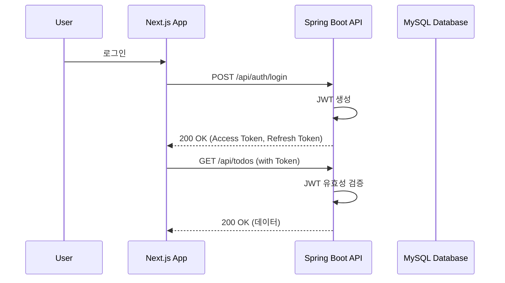

# "감성적인 할일 목록" Fullstack Architecture Document

## 1. Introduction

This document outlines the complete fullstack architecture for "감성적인 할일 목록", including backend systems, frontend implementation, and their integration. It serves as the single source of truth for AI-driven development, ensuring consistency across the entire technology stack.

This unified approach combines what would traditionally be separate backend and frontend architecture documents, streamlining the development process for modern fullstack applications where these concerns are increasingly intertwined.

### Starter Template or Existing Project

N/A - Greenfield project

### Change Log

| Date | Version | Description | Author |
| :--- | :--- | :--- | :--- |
| 2025-09-20 | 1.0 | Initial architecture draft | martin (Architect) |

---

## 2. High Level Architecture

### Technical Summary

The architecture will be a traditional client-server model, optimized for local MVP development. The frontend will be a Next.js single-page application (SPA) communicating with a backend REST API. The backend is an existing Spring Boot application, which connects to a MySQL database running locally in a Docker container. This setup allows for rapid, focused development of the MVP within a self-contained local environment.

### Platform and Infrastructure Choice

-   **Platform:** Docker Desktop (Local Development)
-   **Key Services:** Docker Compose, Local MySQL Container, Local Spring Boot Application, Local Next.js Development Server
-   **Deployment Host and Regions:** N/A (로컬 개발 전용)

### Repository Structure

-   **Structure:** Monorepo
-   **Monorepo Tool:** Not specified, manual management via separate `frontend` and `backend` directories.
-   **Package Organization:** `backend` (Spring Boot API), `frontend` (Next.js web app)

### High Level Architecture Diagram

```mermaid
graph TD
    subgraph User's Machine (localhost)
        subgraph Browser
            U[사용자] -- http://localhost:3000 --> F[Next.js Dev Server]
        end

        subgraph Backend
            F -- API Request (http://localhost:8080/api) --> S[Spring Boot App]
        end

        subgraph Docker
            S -- JDBC --> DB[(MySQL Container)]
        end
    end

    style F fill:#cde4ff
    style S fill:#d4edda
    style DB fill:#f5c6cb
```

### Architectural Patterns

-   **Hexagonal Architecture (Ports & Adapters):** The backend's core business logic (domain) will be isolated from external concerns like the UI, database, or other APIs. The core will communicate with the outside world through "ports" (interfaces), and the external components ("adapters") will implement these ports. _Rationale:_ This creates a loosely coupled, highly testable, and technology-agnostic application core, making it easier to maintain and evolve.
-   **Domain-Driven Design (DDD):** We will model the software to match the business domain ("감성적인 할일 목록"). This involves creating a rich domain model with entities, value objects, and aggregates, and using a Ubiquitous Language shared by developers and domain experts. _Rationale:_ Ensures the software accurately reflects and solves the core business problem, leading to a more robust and understandable design.
-   **Single Page Application (SPA):** A dynamic Next.js application will run in the browser, providing a rich user experience and making API calls to the backend for data. _Rationale:_ Decouples frontend from backend, allowing independent development and deployment.
-   **REST API (Adapter):** The Spring Boot application will expose a RESTful API. This API will be an "adapter" that translates HTTP requests into calls to the application's core logic via its ports. _Rationale:_ A standard, well-understood pattern for client-server communication that fits neatly into the Hexagonal architecture.
-   **Containerization (Docker):** The database dependency (MySQL) is managed via Docker Compose. _Rationale:_ Ensures a consistent, isolated, and easily reproducible development environment.

---

## 3. Tech Stack

### Technology Stack Table

| Category | Technology | Version | Purpose | Rationale |
| :--- | :--- | :--- | :--- | :--- |
| Frontend Language | TypeScript | 5.x | 타입 안정성, 코드 유지보수성 | JavaScript에 타입을 추가하여 개발 중 오류를 줄이고, 코드의 가독성과 유지보수성을 높입니다. |
| Frontend Framework | Next.js | 14.x | UI 렌더링, SPA 라우팅 | React 기반 프레임워크로, 빠른 개발 속도와 강력한 개발 서버 기능을 제공합니다. |
| UI Component Library | Material-UI (MUI) | 5.x | UI 컴포넌트 | `front-end-spec.md`에서 언급된 대로, 성숙하고 풍부한 컴포넌트를 제공하여 UI 개발을 가속화합니다. |
| State Management | Zustand | 4.x | 프론트엔드 상태 관리 | 간단하고 직관적인 API를 제공하여, MVP 단계에서 빠르고 효율적인 상태 관리를 가능하게 합니다. |
| Backend Language | Java | 17 | 백엔드 비즈니스 로직 | 안정적이고 성숙한 언어이며, Spring Boot 프레임워크와의 호환성이 뛰어납니다. |
| Backend Framework | Spring Boot | 3.x | REST API 서버 구축 | `application.yml`에서 확인된 대로, 빠르고 쉽게 독립 실행형 애플리케이션을 만들 수 있습니다. |
| API Style | REST | | 클라이언트-서버 통신 | 표준적이고 널리 사용되는 방식으로, 명확한 자원 기반의 상호작용을 정의합니다. |
| Database | MySQL | 8.0 | 데이터 영속성 | `docker-compose.yml`에서 확인된 대로, 신뢰성 높고 널리 사용되는 관계형 데이터베이스입니다. |
| Authentication | Spring Security | 6.x | 인증 및 인가 | Spring 생태계의 표준 보안 프레임워크로, 강력하고 유연한 보안 기능을 제공합니다. |
| Frontend Testing | Jest + RTL | latest | 프론트엔드 단위/통합 테스트 | React 애플리케이션 테스트를 위한 산업 표준 조합입니다. |
| Backend Testing | JUnit 5 + Mockito | latest | 백엔드 단위/통합 테스트 | Spring Boot 애플리케이션 테스트를 위한 표준 조합입니다. |
| E2E Testing | Playwright | latest | End-to-End 테스트 | 모든 주요 브라우저를 지원하며, 빠르고 안정적인 E2E 테스트를 가능하게 합니다. |
| Build Tool | Gradle / npm | latest | 의존성 관리 및 빌드 | 각각 백엔드와 프론트엔드의 표준 빌드 도구입니다. |
| Bundler | Webpack | 5.x | 프론트엔드 에셋 번들링 | Next.js에 내장되어 있으며, 코드 최적화 및 번들링을 자동으로 처리합니다. |
| IaC Tool | Docker Compose | | 로컬 개발 환경 구성 | `docker-compose.yml`을 통해 로컬 개발 환경을 일관되게 관리합니다. |
| Logging | SLF4J + Logback | | 백엔드 로깅 | Spring Boot의 표준 로깅 구현체로, 유연한 로깅 설정을 제공합니다. |
| CSS Framework | Emotion | 11.x | UI 스타일링 | Material-UI의 기본 스타일링 엔진으로, CSS-in-JS 방식을 통해 컴포넌트 기반 스타일링을 지원합니다. |

---

## 4. Data & API Design

### 4.1. Data Models

#### Todo
**Purpose:** 사용자가 완료해야 할 단일 작업을 나타냅니다. 이 애플리케이션의 핵심 엔티티(Entity)입니다.
**Key Attributes:**
- `id`: `Long` - 고유 식별자 (Primary Key)
- `content`: `String` - 할 일의 내용
- `completed`: `Boolean` - 할 일의 완료 여부
- `createdAt`: `LocalDateTime` - 생성 일시
**TypeScript Interface**
```typescript
interface Todo {
  id: number;
  content: string;
  completed: boolean;
  createdAt: string; // ISO 8601 format
}
```
**Relationships**
- `BasilPot`과 간접적인 관계를 가집니다. (할 일이 완료될 때마다 화분의 성장에 영향을 줍니다.)

#### BasilPot
**Purpose:** 사용자의 성장을 나타내며, 할 일 완료에 대한 시각적 보상 역할을 합니다. DDD 관점에서 보면, 사용자의 성취 상태를 나타내는 Aggregate Root가 될 수 있습니다.
**Key Attributes:**
- `id`: `Long` - 고유 식별자 (Primary Key)
- `level`: `Integer` - 바질 화분의 현재 성장 레벨. 1부터 시작합니다.
- `experience`: `Integer` - 다음 레벨까지 필요한 경험치. 할 일을 완료할 때마다 증가합니다.
- `userId`: `Long` - 이 화분의 소유자 ID.
**TypeScript Interface**
```typescript
interface BasilPot {
  id: number;
  level: number;
  experience: number;
  userId: number;
}
```
**Relationships**
-   User와 1:1 관계를 가집니다.
-   `Todo`가 완료될 때마다 `experience`가 업데이트됩니다. (도메인 이벤트)

### 4.2. Database Schema
```sql
-- 사용자(Users) 테이블
CREATE TABLE `users` (
  `id` BIGINT NOT NULL AUTO_INCREMENT,
  `username` VARCHAR(255) NOT NULL, -- 이메일을 ID로 사용할 가능성을 위해 255자로 유지
  `password` VARCHAR(255) NOT NULL, -- 비밀번호는 해시된 결과를 저장
  `nickname` VARCHAR(30) NOT NULL,
  `created_at` DATETIME(6) NOT NULL DEFAULT CURRENT_TIMESTAMP(6),
  PRIMARY KEY (`id`),
  UNIQUE KEY `uk_username` (`username`)
) ENGINE=InnoDB DEFAULT CHARSET=utf8mb4 COLLATE=utf8mb4_unicode_ci;

-- 할 일(Todo) 테이블
CREATE TABLE `todos` (
  `id` BIGINT NOT NULL AUTO_INCREMENT,
  `content` VARCHAR(255) NOT NULL,
  `completed` BOOLEAN NOT NULL DEFAULT FALSE,
  `created_at` DATETIME(6) NOT NULL DEFAULT CURRENT_TIMESTAMP(6),
  `user_id` BIGINT NOT NULL,
  PRIMARY KEY (`id`),
  CONSTRAINT `fk_todos_to_users` FOREIGN KEY (`user_id`) REFERENCES `users` (`id`)
) ENGINE=InnoDB DEFAULT CHARSET=utf8mb4 COLLATE=utf8mb4_unicode_ci;

-- 바질 화분(BasilPot) 테이블
CREATE TABLE `basil_pot` (
  `id` BIGINT NOT NULL AUTO_INCREMENT,
  `level` INT NOT NULL DEFAULT 1,
  `experience` INT NOT NULL DEFAULT 0,
  `user_id` BIGINT NOT NULL,
  PRIMARY KEY (`id`),
  UNIQUE KEY `uk_user_id` (`user_id`),
  CONSTRAINT `fk_basil_pot_to_users` FOREIGN KEY (`user_id`) REFERENCES `users` (`id`)
) ENGINE=InnoDB DEFAULT CHARSET=utf8mb4 COLLATE=utf8mb4_unicode_ci;
```

### 4.3. API Specification
```yaml
openapi: 3.0.0
info:
  title: 감성적인 할일 목록 API
  version: v0.1.0
  description: 감성적인 할일 목록 MVP를 위한 백엔드 API 명세서
servers:
  - url: http://localhost:8080/api
    description: Local development server
paths:
  /todos:
    get:
      summary: 모든 할 일 목록 조회
      responses:
        '200':
          description: 성공
          content:
            application/json:
              schema:
                type: array
                items:
                  $ref: '#/components/schemas/Todo'
    post:
      summary: 새로운 할 일 추가
      requestBody:
        required: true
        content:
          application/json:
            schema:
              $ref: '#/components/schemas/NewTodo'
      responses:
        '201':
          description: 생성됨
          content:
            application/json:
              schema:
                $ref: '#/components/schemas/Todo'
  /todos/{id}/complete:
    patch:
      summary: 특정 할 일 완료 처리
      parameters:
        - name: id
          in: path
          required: true
          schema:
            type: integer
            format: int64
      responses:
        '200':
          description: 성공
          content:
            application/json:
              schema:
                $ref: '#/components/schemas/Todo'
  /basil-pot:
    get:
      summary: 바질 화분 상태 조회
      responses:
        '200':
          description: 성공
          content:
            application/json:
              schema:
                $ref: '#/components/schemas/BasilPot'
components:
  schemas:
    Todo:
      type: object
      properties:
        id:
          type: integer
          format: int64
        content:
          type: string
        completed:
          type: boolean
        createdAt:
          type: string
          format: date-time
    NewTodo:
      type: object
      properties:
        content:
          type: string
    BasilPot:
      type: object
      properties:
        id:
          type: integer
          format: int64
        level:
          type: integer
        experience:
          type: integer
        userId:
          type: integer
          format: int64
```

---

## 5. Backend Architecture

### 5.1. Service Architecture
#### Service (Controller) Organization
```text
src/main/java/com/study/todolist/
├── domain/
├── application/
└── adapter/
    ├── in/
    │   └── web/
    │       ├── dto/
    │       └── TodoController.java
    └── out/
        └── persistence/
```
#### Controller Template
```java
@RestController
@RequestMapping("/api/todos")
@RequiredArgsConstructor
public class TodoController {
    private final TodoUseCase todoUseCase;
    // ...
}
```

### 5.2. Database Architecture
#### Data Access Layer
**Output Port**
```java
public interface TodoPort {
    Todo save(Todo todo);
    Optional<Todo> findById(Long id);
    List<Todo> findAllByUserId(Long userId);
}
```
**Persistence Adapter**
```java
@Repository
@RequiredArgsConstructor
public class TodoPersistenceAdapter implements TodoPort {
    private final TodoRepository todoRepository;
    // ...
}
```
**Spring Data JPA Repository**
```java
interface TodoRepository extends JpaRepository<Todo, Long> {
    List<Todo> findAllByUserId(Long userId);
}
```

### 5.3. Auth Architecture
#### Auth Flow

```mermaid
sequenceDiagram
    participant User
    participant Frontend as Next.js App
    participant Backend as Spring Boot API
    participant DB as MySQL Database
    User->>Frontend: 로그인
    Frontend->>Backend: POST /api/auth/login
    Backend->>Backend: JWT 생성
    Backend-->>Frontend: 200 OK (Access Token, Refresh Token)
    Frontend->>Backend: GET /api/todos (with Token)
    Backend->>Backend: JWT 유효성 검증
    Backend-->>Frontend: 200 OK (데이터)
```
#### Auth Middleware/Filter
```java
@Configuration
@EnableWebSecurity
@RequiredArgsConstructor
public class SecurityConfig {
    // ...
    @Bean
    public SecurityFilterChain securityFilterChain(HttpSecurity http) throws Exception {
        http
            .csrf().disable()
            .sessionManagement().sessionCreationPolicy(SessionCreationPolicy.STATELESS)
            .and()
            .authorizeHttpRequests(auth -> auth
                .requestMatchers("/api/auth/**").permitAll()
                .anyRequest().authenticated()
            )
            .addFilterBefore(jwtAuthenticationFilter, UsernamePasswordAuthenticationFilter.class);
        return http.build();
    }
}
```

---

## 6. Frontend Architecture

### 6.1. Component Architecture
#### Component Organization
```text
src/
├── components/
├── features/
└── pages/
```
#### Component Template
```typescript
const MyComponent: React.FC<MyComponentProps> = ({ title }) => {
  // ...
};
```

### 6.2. State Management Architecture
#### State Structure
```typescript
const useAppStore = create<TodoSlice & BasilPotSlice>()((set) => ({
  // ...
}));
```
#### State Management Patterns
- Single Source of Truth
- Slice Pattern
- Selectors for Performance
- Async Actions in Hooks

### 6.3. Routing Architecture
#### Route Organization
```text
src/app/
├── layout.tsx
├── page.tsx
├── login/
│   └── page.tsx
└── signup/
    └── page.tsx
```
#### Protected Route Pattern
```typescript
// middleware.ts
export function middleware(request: NextRequest) {
  // ...
}
```

### 6.4. Frontend Services Layer
#### API Client Setup
```typescript
// src/lib/apiClient.ts
const apiClient = axios.create({
  baseURL: process.env.NEXT_PUBLIC_API_URL || 'http://localhost:8080/api',
  // ...
});
```
#### Service Example
```typescript
// src/features/todo/services/todoService.ts
export const getTodos = async (): Promise<Todo[]> => {
  // ...
};
```

---

## 7. Unified Project Structure
```plaintext
todolist/
├── frontend/
├── backend/
├── docs/
├── .gitignore
├── docker-compose.yml
└── README.md
```

---

## 8. Development & Operations

### 8.1. Development Workflow
#### Prerequisites
```bash
# Java 17, Node.js 18, Docker
```
#### Initial Setup
```bash
# docker-compose up, npm install, ./gradlew build
```
#### Development Commands
```bash
# ./gradlew bootRun
# npm run dev
```

### 8.2. Environment Configuration
**Backend (`/backend/.env`)**
```bash
DB_HOST=localhost
DB_USERNAME=root
JWT_SECRET_KEY=...
```
**Frontend (`/frontend/.env.local`)**
```bash
NEXT_PUBLIC_API_URL=http://localhost:8080/api
```

### 8.3. Deployment Architecture
향후 설계 예정 (N/A for MVP)

---

## 9. Quality Assurance

### 9.1. Security and Performance
**Security Requirements**
- Backend: Input Validation, Password Hashing (BCrypt), JWT Auth, CORS
- Frontend: Secure Token Storage (HttpOnly Cookie), Env Var Scoping

**Performance Optimization**
- Frontend: Code Splitting, Image Optimization, Bundle Size Target (<200KB)
- Backend: Response Time Target (<200ms), DB Indexing, Connection Pooling

### 9.2. Testing Strategy
**Testing Pyramid**
```text
      /------------------\
     /   E2E Tests      \
    /--------------------
   /  Integration Tests   \
  /------------------------\ 
 /       Unit Tests         \
/----------------------------\ 
```
**Test Organization**
- FE: Co-location for unit, feature-based for integration
- BE: Mirrored package structure in `src/test/java`
- E2E: Root `/e2e` directory

---

## 10. Standards & Policies

### 10.1. Coding Standards
**Critical Rules**
- Hexagonal Architecture Adherence
- DTO Usage in Controllers
- Service Layer Responsibility
- Configuration via Environment Variables
- Immutability

**Naming Conventions**
(Table as defined before)

### 10.2. Error Handling Strategy
**Error Response Format**
```typescript
interface ApiError {
  error: {
    code: string;
    message: string;
    // ...
  };
}
```
**Backend Error Handling**
- Use of `@RestControllerAdvice` for global exception handling.

---

## 11. Monitoring and Observability
향후 설계 예정 (N/A for MVP)

---

## 12. Checklist Results Report
(To be filled in after checklist execution)

```
