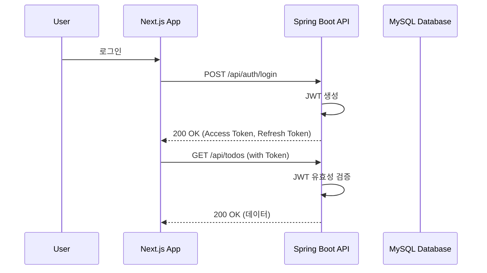

# 5. Backend Architecture

## 5.1. Service Architecture
### Service (Controller) Organization
```text
src/main/java/com/study/todolist/
├── domain/
├── application/
└── adapter/
    ├── in/
    │   └── web/
    │       ├── dto/
    │       └── TodoController.java
    └── out/
        └── persistence/
```
### Controller Template
```java
@RestController
@RequestMapping("/api/todos")
@RequiredArgsConstructor
public class TodoController {
    private final TodoUseCase todoUseCase;
    // ...
}
```

## 5.2. Database Architecture
### Data Access Layer
**Output Port**
```java
public interface TodoPort {
    Todo save(Todo todo);
    Optional<Todo> findById(Long id);
    List<Todo> findAllByUserId(Long userId);
}
```
**Persistence Adapter**
```java
@Repository
@RequiredArgsConstructor
public class TodoPersistenceAdapter implements TodoPort {
    private final TodoRepository todoRepository;
    // ...
}
```
**Spring Data JPA Repository**
```java
interface TodoRepository extends JpaRepository<Todo, Long> {
    List<Todo> findAllByUserId(Long userId);
}
```

## 5.3. Auth Architecture
### Auth Flow

### Auth Middleware/Filter
```java
@Configuration
@EnableWebSecurity
@RequiredArgsConstructor
public class SecurityConfig {
    // ...
    @Bean
    public SecurityFilterChain securityFilterChain(HttpSecurity http) throws Exception {
        http
            .csrf().disable()
            .sessionManagement().sessionCreationPolicy(SessionCreationPolicy.STATELESS)
            .and()
            .authorizeHttpRequests(auth -> auth
                .requestMatchers("/api/auth/**").permitAll()
                .anyRequest().authenticated()
            )
            .addFilterBefore(jwtAuthenticationFilter, UsernamePasswordAuthenticationFilter.class);
        return http.build();
    }
}
```

---
