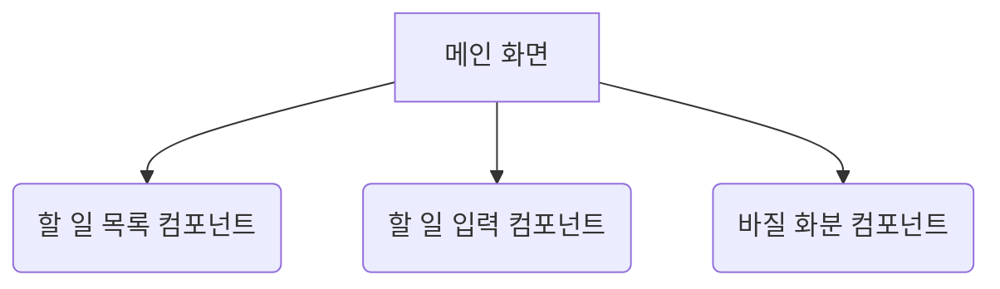

# "감성적인 할일 목록" UI/UX 명세서

**버전:** 0.1
**날짜:** 2025-09-18

---

## 1. 소개

이 문서는 "감성적인 할일 목록" 웹 애플리케이션의 사용자 경험(UX) 목표, 정보 구조, 사용자 흐름, 그리고 시각 디자인 명세를 정의합니다. 이 문서는 시각 디자인과 프론트엔드 개발의 기반이 되어, 일관성 있고 사용자 중심적인 경험을 보장하는 것을 목표로 합니다.

### 전반적인 UX 목표 및 원칙

- **대상 사용자 페르소나:**
    - **"위로가 필요한 직장인":** 바쁜 업무 속에서 작은 성취감과 심리적 안정감을 얻고 싶어하는 사용자. 효율성도 중요하지만, 그 과정에서 느끼는 긍정적인 감성과 경험을 더 중요하게 생각합니다.

- **사용성 목표:**
    - **쉬운 학습:** 새로운 사용자가 앱을 처음 열고 1분 안에 첫 할 일을 추가하고 완료할 수 있다.
    - **정서적 만족:** 사용자가 할 일을 완료할 때마다 '작은 기쁨'이나 '위로'를 느낄 수 있다.
    - **방해받지 않는 경험:** 불필요한 기능이나 복잡한 설정 없이, 오직 할 일 관리에만 집중할 수 있다.

- **디자인 원칙:**
    1.  **따뜻함과 단순함:** 모든 디자인 요소는 따뜻한 느낌을 주며, 기능은 최대한 단순하게 유지한다.
    2.  **긍정적 피드백:** 사용자의 모든 긍정적인 행동(특히 할 일 완료)에 대해 즉각적이고 기분 좋은 피드백을 제공한다.
    3.  **점진적인 성장:** 바질 화분이 자라나는 것처럼, 사용자의 노력이 시각적으로 축적되는 모습을 보여주어 장기적인 만족감을 준다.

### 변경 기록
| 날짜 | 버전 | 설명 | 작성자 |
| :--- | :--- | :--- | :--- |
| 2025-09-18 | 0.1 | 초기 문서 초안 작성 | Sally (UX) |

---

## 2. 정보 구조 (Information Architecture)

### 사이트맵 / 화면 구성



### 네비게이션 구조

- **주 네비게이션:** 없음. 모든 기능이 단일 화면에 제공됩니다.
- **보조 네비게이션:** 없음.
- **이동 경로 (Breadcrumb):** 없음.

---

## 3. 사용자 흐름 (User Flows)

### 흐름 1: 할 일 추가하기
- **사용자 목표:** 새로운 할 일을 목록에 추가하고 싶다.
- **진입점:** 사용자가 웹사이트를 열었을 때.
- **성공 기준:** 새로운 할 일이 목록의 마지막에 나타난다.
- **흐름도:**
    ```mermaid
    graph TD
        A[시작: 메인 화면] --> B{텍스트 입력};
        B --> C[추가 버튼 클릭];
        C --> D[API 요청: 할 일 생성];
        D -- 성공 --> E[목록에 새 할 일 표시];
        D -- 실패 --> F[에러 메시지 표시];
        E --> G[종료];
        F --> G[종료];
    ```
- **예외 상황 및 처리:**
    - 사용자가 아무것도 입력하지 않고 '추가' 버튼을 누르는 경우: 버튼이 비활성화되거나, '할 일을 입력해주세요' 같은 안내 메시지를 보여준다.
    - 네트워크 오류로 API 요청이 실패하는 경우: '저장에 실패했습니다. 잠시 후 다시 시도해주세요.' 같은 스낵바/토스트 메시지를 보여준다.

### 흐름 2: 할 일 완료하기
- **사용자 목표:** 기존 할 일을 완료 처리하고 '작은 위로'를 받고 싶다.
- **진입점:** 메인 화면의 할 일 목록.
- **성공 기준:** 할 일이 완료 처리되고, 보상(화분 성장, 메시지, 효과)이 주어진다.
- **흐름도:**
    ```mermaid
    graph TD
        A[시작: 할 일 목록] --> B{'완료' 버튼 클릭};
        B --> C[API 요청: 할 일 수정];
        C -- 성공 --> D[할 일에 취소선 표시];
        D --> E[바질 화분 성장!];
        E --> F[격려 메시지 표시];
        F --> G[반짝이는 시각 효과];
        G --> H[종료];
        C -- 실패 --> I[에러 메시지 표시];
        I --> H[종료];
    ```
- **예외 상황 및 처리:**
    - 사용자가 이미 완료된 할 일을 다시 클릭하는 경우: 아무 동작도 하지 않는다. (MVP 범위)
    - 네트워크 오류로 API 요청이 실패하는 경우: '완료 처리에 실패했습니다.' 같은 메시지를 보여주고, UI를 원래 상태로 되돌린다.

---

## 4. 와이어프레임 및 목업

- **기본 디자인 파일:** 별도의 디자인 파일(예: Figma)은 없으며, 이 명세서를 기반으로 AI UI 생성 도구(v0 등)를 사용하여 초기 디자인 컨셉을 생성할 것입니다.

### 핵심 화면 레이아웃

- **화면 이름:** 메인 화면
- **목적:** 사용자가 할 일을 관리하고, 바질 화분의 성장을 보며 위로를 받는 핵심 공간.
- **핵심 요소:**
    - 화면 상단 중앙: **바질 화분 이미지**
    - 화면 중단: **할 일 목록** (각 항목은 체크박스와 텍스트로 구성)
    - 화면 하단: **할 일 추가 입력 필드**와 **'추가' 버튼**
    - 숨겨진 요소: 할 일 완료 시 나타나는 **격려 메시지**와 **시각 효과**
- **상호작용 노트:** 전체적으로 부드럽고 차분한 애니메이션을 사용합니다. 할 일 완료 시, 화분이 미세하게 성장하고, 격려 메시지는 부드럽게 나타났다가 사라집니다.
- **디자인 파일 참조:** 해당 없음

---

## 5. 컴포넌트 라이브러리 / 디자인 시스템

- **디자인 시스템 접근 방식:** 기존의 성숙한 컴포넌트 라이브러리(예: Material-UI)를 사용하되, 우리의 '감성적인' 테마에 맞게 색상, 폰트, 애니메이션 등을 커스터마이징하여 사용합니다. 새로운 디자인 시스템을 구축하지는 않습니다.

### 핵심 컴포넌트

- **할 일 항목 (To-Do Item)**
    - **목적:** 개별 할 일을 표시하고, 완료 상태를 관리합니다.
    - **종류:** 기본(Default), 완료(Completed - 텍스트에 취소선).
    - **상태:** 호버(Hover - 배경색 약간 변경).
- **입력 필드 (Input Field)**
    - **목적:** 사용자가 새로운 할 일 텍스트를 입력합니다.
    - **상태:** 활성(Active - 테두리 색 변경), 비활성(Disabled).
- **버튼 (Button)**
    - **목적:** '추가'와 같은 주요 행동을 실행합니다.
    - **상태:** 기본(Default), 호버(Hover), 비활성(Disabled - 입력창이 비었을 때).
- **화분 디스플레이 (Plant Display)**
    - **목적:** 바질 화분의 현재 성장 단계를 보여줍니다.
    - **종류:** 여러 성장 단계 이미지 (예: 1단계, 2단계, ...).
- **알림/토스트 (Notification/Toast)**
    - **목적:** 격려 메시지나 에러 메시지를 잠시 보여줍니다.
    - **종류:** 성공/격려(Success/Encouragement), 에러(Error).

---

## 6. 브랜딩 및 스타일 가이드

- **시각적 아이덴티티:** 별도의 공식 브랜드 가이드라인은 없으며, 이 문서에서 정의하는 스타일을 따릅니다.

### 색상 팔레트
| 종류 | Hex 코드 | 사용처 |
| :--- | :--- | :--- |
| 주 색상 (Primary) | `#A5D6A7` | 버튼, 활성화 상태, 긍정적 피드백 |
| 보조 색상 (Secondary) | `#F5F5DC` | 카드 배경, 구분선 등 |
| 강조 색상 (Accent) | `#E57373` | 주의, 에러 등 |
| 중립 색상 (Neutral) | `#FAF9F6` (배경), `#424242` (텍스트) | 기본 배경 및 텍스트 |

### 타이포그래피
- **폰트:**
    - **주요 폰트 (제목, UI 요소):** Nanum Myeongjo (Google Fonts)
    - **보조 폰트 (본문, 격려 메시지):** Nanum Pen Script (Google Fonts)
- **글자 크기:**
    - 제목 (H1): 28px
    - 소제목 (H2): 22px
    - 본문 (Body): 16px

### 아이코노그래피
- **아이콘 라이브러리:** Material Icons 또는 유사한 미니멀리즘 스타일의 아이콘을 사용합니다.
- **사용 가이드라인:** 아이콘은 꼭 필요한 경우(예: 추가 버튼의 '+' 아이콘)에만 제한적으로 사용합니다.

### 간격 및 레이아웃
- **간격 시스템:** 8px 기반의 간격 시스템을 사용합니다 (8px, 16px, 24px...).
- **그리드 시스템:** 중앙 정렬된 단일 컬럼 레이아웃을 사용합니다.

---

## 7. 접근성 요구사항

- **준수 목표:** WCAG 2.1 Level AA. 우리는 모든 사용자가 동등하게 '작은 위로'를 경험할 수 있도록 노력합니다.

### 핵심 요구사항
- **시각:**
    - **명도 대비:** 텍스트와 배경의 명도 대비는 최소 4.5:1을 준수합니다.
    - **포커스 표시:** 키보드로 탐색 시, 현재 포커스된 요소(버튼, 입력창 등)는 명확한 외곽선으로 표시됩니다.
- **상호작용:**
    - **키보드 네비게이션:** 마우스 없이 키보드만으로 모든 기능(할 일 추가, 완료)을 사용할 수 있어야 합니다.
    - **스크린 리더 지원:** 모든 인터랙티브 요소에 명확한 레이블(aria-label)을 제공합니다. (예: '완료' 버튼은 "(할일 내용) 완료하기"로 읽힘)
- **콘텐츠:**
    - **대체 텍스트:** 의미를 가지는 모든 이미지(예: 바질 화분)에는 대체 텍스트를 제공합니다. (예: "바질 화분, 3단계 성장")
    - **폼 레이블:** 모든 입력 필드에는 명확한 레이블이 연결되어야 합니다.

### 테스트 전략
- 개발 과정에서 Lighthouse, axe와 같은 자동화된 접근성 검사 도구를 사용하고, 실제 키보드 탐색 및 스크린 리더 테스트를 병행합니다.

---

## 8. 반응형 전략

### 중단점 (Breakpoints)
| 중단점 | 최소 너비 | 대상 디바이스 |
| :--- | :--- | :--- |
| 모바일 | 0px | 스마트폰 |
| 데스크탑 | 768px | 태블릿, 데스크탑 |

### 화면 크기별 적응 패턴
- **레이아웃 변경:**
    - **모바일:** 화면 전체 너비를 사용합니다.
    - **데스크탑:** 콘텐츠의 최대 너비를 600px로 제한하고, 화면 중앙에 배치하여 가독성을 높입니다.
- **콘텐츠 우선순위:** 모든 화면 크기에서 콘텐츠(화분, 목록, 입력창)는 동일한 순서로 표시됩니다.
- **상호작용 변경:** 모바일 환경에서 버튼과 같은 터치 대상의 크기가 최소 44x44px를 만족하는지 확인합니다.

---

## 9. 애니메이션 및 마이크로인터랙션

- **모션 원칙:** 애니메이션은 사용자의 주의를 뺏지 않고, 차분하고 부드러워야 합니다. 모든 움직임은 기능적 목적을 가지거나, 긍정적인 감성을 강화하는 데 사용됩니다. 빠르고 현란한 효과는 피합니다.

### 핵심 애니메이션
- **할 일 완료 시 화분 성장:**
    - **설명:** 할 일을 완료하면, 바질 화분이 다음 단계 이미지로 부드럽게 전환(cross-fade)되면서, 미세하게 커졌다 작아지는 효과(pulse)가 한 번 나타납니다.
    - **지속 시간:** ~500ms
    - **속도 곡선:** Ease-in-out
- **격려 메시지 표시:**
    - **설명:** 격려 메시지가 부드럽게 나타났다가(fade-in), 몇 초 후 부드럽게 사라집니다(fade-out).
    - **지속 시간:** ~300ms (fade-in/out)
    - **속도 곡선:** Linear
- **반짝이는 시각 효과:**
    - **설명:** 완료된 할 일 주변이나 화분 주변에서 작은 반짝이 파티클 몇 개가 잠시 나타났다가 사라집니다.
    - **지속 시간:** ~400ms
    - **속도 곡선:** Ease-out

---

## 10. 성능 고려사항

### 성능 목표
- **페이지 로드:** 첫 방문 시 3초 이내, 재방문 시 1.5초 이내에 상호작용 가능하도록 합니다. (LCP 기준)
- **상호작용 응답:** 사용자의 모든 입력(클릭, 키보드 입력)에 대한 시각적 피드백은 100ms 이내에 이루어져야 합니다.
- **애니메이션 FPS:** 모든 애니메이션은 60fps를 유지하여 부드러운 경험을 제공해야 합니다.

### 디자인 전략
- **이미지 최적화:** 바질 화분 이미지는 WebP와 같은 현대적인 포맷을 사용하고, 파일 크기를 최소화합니다.
- **코드 분할:** 필요하지 않은 JavaScript는 초기 로딩 시에 불러오지 않도록 합니다. (예: React.lazy 사용)
- **애니메이션 최적화:** CSS Transform 및 Opacity를 사용한 애니메이션을 우선적으로 사용하여 GPU 가속을 활용합니다.
